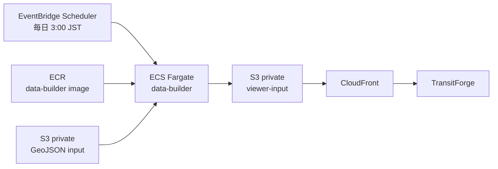

# アーキテクチャ図

このディレクトリのAWS構成図は、`infra/terraform/environments/dev` と
GitHub Actionsのversioned configurationを正として作成している。

## AWSサービス構成

閲覧、AI問い合わせ、収録事業者APIの混雑・遅延1分収集と履歴保存の
実行時経路を示す。

- [編集用draw.ioファイル](transitforge-aws-runtime.drawio)
- [SVGファイル](transitforge-aws-runtime.svg)

静的viewer-inputの生成・公開経路は次のとおり。日次バッチはWebアプリのデプロイとは
独立している。

## GitHub ActionsからAWSへのデプロイ

GitHub OIDC、IAMロール、Terraform state、mainへのマージ後の
devデプロイ経路を示す。固定AWSアクセスキーは使用しない。

- [編集用draw.ioファイル](transitforge-github-aws-deployment.drawio)
- [SVGファイル](transitforge-github-aws-deployment.svg)

## 更新方法

`.drawio` をdiagrams.netで編集し、SVGへ再エクスポートする。
AWSサービスにはdiagrams.netのAWS4ステンシルを使用している。
アイコンの利用条件と最新版は
[AWS Architecture Icons](https://aws.amazon.com/architecture/icons/)を参照する。
