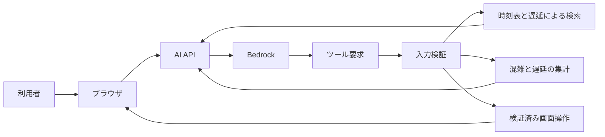

# コンシェルジュの境界

## 目的

コンシェルジュは自然文を検索条件と安全な画面操作へ変換する
モデルへ列車データ全体やブラウザ操作権限を渡さない

Bedrockは構造化されたAgent Contextから利用者のgoal hard constraint soft preferenceを解釈し
必要なEvidence 追加質問 Tool 候補比較 最終推薦を判断する。Applicationは自然言語の業務フローを
別ルールエンジンとして再実装せず Context構築とboundedな実行を担う。時刻表 経路 運行情報
外部Provider Evidence Claim Viewer Action safety privacyは決定論的コードを正本とする。

責務の詳細と段階移行は[ADR 0044](../decisions/0044-make-bedrock-the-agent-decision-authority.md)を参照する。



開発サーバーでAI APIへ接続できない場合だけローカル解析へフォールバックする
本番ではAPI失敗を成功として扱わず再試行案内を表示する

## 機能

| 機能 | 動作 |
| --- | --- |
| 列車検索 | 駅 種別 列車名 列車番号から運行中列車を検索 |
| 到着検索 | 指定時刻の前後30分に指定駅へ到着する列車を検索 |
| 経路検索 | 営業日ごとの接続インデックスから直通または乗換3回までの最大3件を検索 |
| 代表ダイヤ検索 | 平日と土休日の代表ダイヤから最大5件を検索 |
| 混雑分析 | 業務日付の日次ピーク 時間別傾向 路線別 列車別を集計 |
| 遅延分析 | 最新状況 日次ピーク 時間別傾向 列車別を集計 |
| 旅行相談の追加質問 | 次の質問 選択肢 TripContext を構造化して返し ブラウザは共通UIで回答を受け取る |
| 画面操作 | 時刻 列車フォーカス 可視化レイヤーを変更 |
| 防災情報 | 気象庁の公式フィードから旅行先に現在発表中の情報を検索 |
| 駅から先の移動 | 検証済み駅とPlace間の徒歩 車 自転車経路を検索 |
| 飲食店検索 | 地域 ジャンル 位置から食事候補を検索 |

## 経路検索

- 出発駅 到着駅 業務日付 希望時刻をバックエンドへ送る
- 利用者の日付指定は暦日として解釈し 4時未満は前の業務日付と24時超時刻へ変換する
- 平日と土休日をクライアントで判定せず 日付別インデックス内の`timetable_kind`を正とする
- 非公開S3の`timetable-connection-index-v1`を多目的CSAで検索
- 最大3回の乗換を探索し 到着時刻 出発時刻 乗換回数のPareto候補を保持する
- 乗換時間は既定5分と駅固有値を正本にして 急ぐ 普通 ゆっくりで補正する
- 経路優先はバランス 早く着く 遅く出る 乗換少なめから選ぶ
- 帰宅時刻は帰路の出発時刻へ変換せず 到着期限以前の候補から最も遅く出発できる経路を選ぶ
- 遅く出る候補は最速到着から45分以内として 無制限に遅い列車を選ばない
- 展開後の接続インデックスはLambda内で直近1件だけ保持し 日付切替によるメモリ増加を防ぐ
- 設定はブラウザへ保存し 自然言語による指定はその検索だけに適用する
- 出発駅省略時の最寄り駅選択は端末内で行う
- 表示時計を候補列車の発車時刻へ移動しない
- 深夜帯の発着時刻はブラウザで通常時刻へ整形
- 現在の業務日付かつ現在時刻付近ではS3の最新`delays.json`から遅延 行き先変更 運休を評価する
- 乗車予定列車に実測値があれば発着時刻と乗換判定へ直接反映する
- 未観測列車は検索時刻から2時間以内に同じ向きの同一駅間へ入るものに限り 前後90分以内の実測列車から最大3件の中央値を遅延見込みとして反映する
- 逆方向 別の駅間 2時間より先の列車へ遅延を伝播させず 実測遅延と遅延見込みを画面で区別する
- 未来日 過去日 古いスナップショット 取得失敗を含むスナップショットでは計画ダイヤだけを使う
- 候補は構造化データとして返し タブと路線色付き区間として描画する
- 途中停車駅は直前の経路に対する追質問として回答する
- 「京都から岡山は新幹線が良い」のような指定は直前の経路の連続区間として扱い 後続区間と終着駅を維持する
- 区間の別列車や別経路は候補だけを先に返し 利用者が番号か列車名で確定した後に経路を差し替える
- 「新幹線を使わない」「特急を避けて」などは直前の出発駅 到着駅 日付 時刻 乗換設定を保持して再検索する
- 種別 列車名 列車番号 文脈で指定した特定列車を除外でき 連続した依頼では除外条件を引き継ぐ
- 除外対象は候補取得後ではなく接続走査と直通インデックス探索の入口で除外する
- 「やくもに乗りたい」「特急で行きたい」は経路の少なくとも1区間で満たす必須条件として検索する
- 「鈍行で行きたい」「各駅停車だけ」は全区間を普通列車へ限定し 特急 新幹線 快速を混在させない
- 出発駅と到着駅より先に伝えられた希望はブラウザ内だけで一時保持し 次に成功した経路検索へ適用する
- 必須条件は最大4件に制限し 条件充足状態をビットマスクとしてCSAラベルへ含める
- 運賃 座席 空席 景色 観光は対応する正本データがないため検索順位へ使わず 未対応であることを明示する
- 宿泊候補は日程と行き先を明示した場合だけ外部提供者へ問い合わせる。空室と日付別の料金は推測しない

### 対話から検索条件への変換

旅行相談では `ask_follow_up` を使い 出発日 宿泊数 人数などの不足条件を確認する。画面側は
質問の種類を判断せず 構造化された質問と候補を描画する。回答時は保持済みの `TripContext` と
直前の質問をモデルへ渡す。普段の好みである `UserProfile` と 今回限りの `TripContext` は混在させない。
目的地だけが分かる段階は `TripContext.planningStage=inspiration` とし `search_place_media` で
指定場所または地域の写真と位置を確認する。Web検索が利用できる場合は複数の情報源を読んで
場所の特徴 訪問者が評価する点 周辺候補も集める。プロフィールとの相性は推奨として事実と区別する。
この段階では日程を聞かず 旅程を考えたいか確認する。
利用者が望んだら `planningStage=planning` へ進め 宿や正確な経路の検索に必要な日程だけを確認する。
Tool失敗は利用者向け文面へ転載せず 入力の再解決か別Toolで回復する。
構造化Toolの完了を示す内部文言だけを返さず 提案 検索結果 または次の確認質問へ変換する。
スポット名を鉄道経路へ渡す場合は `travelDestinationAccess` でアクセス駅へ正規化する。
追加質問は一度に一条件とし `expectedInput` とクイックリプライを同じ種類に揃える。利用者が
質問より先に泊数を答えた場合も `stayNights` として保持し 後から決まった出発日と結合する。
Toolは機能名や旅行ケース別の分岐で隠さず 実装済みAdapter 現在旅程 side effect境界から
実行可能な能力だけを公開する。Bedrockは構造化Contextとdescriptorから 写真 Web調査 追加質問
旅程検索 変更案のどれが必要かを選ぶ。Applicationは検索順序を強制せず 不正入力 未検証Evidence
旅程がない変更操作 利用できないProviderを決定論的に拒否する。
利用者が明示していない日付をモデルが補っても 宿泊検索の入力には採用しない。
出発日と泊数が揃った後は同じ条件の追加質問を拒否し 宿泊旅行または日帰りの決定論的な検索へ進む。
観光候補を含む旅行提案では `search_place_media` が利用可能なら写真と位置を検索し
未検証のスポット一覧だけで完了しない。写真検索に失敗しても検証済みの鉄道経路と宿泊候補は保持する。
地図上でスポットを選んだ時は同じ地点を詳細検索し ライセンスを確認できる複数写真を遅延取得する。
Web本文から作る見どころ 雰囲気 実用情報 周辺候補は出典を保持し 評価 営業時間 料金はProviderの値がある場合だけ表示する。
地点ID 座標 カテゴリはMapbox SearchのPOIを正とし Wikipediaは名称が一致した地点の説明と画像だけを補完する。
酒蔵のように呼び方が複数ある施設は決定的な検索語展開を行い Mapbox Place IDで重複を除く。
市 県 一般記事をPOIとして表示せず Mapboxで同定できないWeb上の候補へ座標を推測しない。
既存旅程で他の観光スポットや酒蔵などの施設種別を相談された場合は Contextの目的地と日程を維持し
BedrockがWeb検索 ページ確認 POI照合を選ぶ。自治体名 交通手段 施設種別そのものを候補から除外する
検証はTool Adapterへ残す。

| 利用者の表現 | 検索契約 | 適用範囲 |
| --- | --- | --- |
| やくもに乗りたい はるか15号に乗りたい | 必須列車名または列車番号 | 経路の1区間以上 |
| 特急で行きたい 新幹線を使いたい | 必須列車種別 | 経路の1区間以上 |
| 鈍行で行きたい 各駅停車だけ | 許可列車種別を普通へ限定 | 経路の全区間 |
| 特急を使いたくない 1005Mを避けて 在来線で行きたい | 除外する種別 列車名 列車番号 列車ID | 経路の全区間 |
| 乗換なし 乗換2回まで | 最大乗換回数 | 経路全体 |
| ゆっくり乗換 早く着きたい 遅く出たい | 乗換ペースまたは順位 | 候補探索と並び順 |

列車名は号数を省略した系列名と号数付きの特定列車を区別する
例えば「やくも」はやくも各号のいずれかを許し「やくも5号」はその列車だけを許す
必須条件を満たさない最速経路が条件付き経路を支配しないよう 条件充足状態ごとにParetoラベルを保持する

検索ごとに`journey_search_trace`を構造化ログへ出す
接続走査数 支配判定で除外したラベル数 乗換時間不足 打ち切り条件
採用経路 乗換駅 待ち時間 適用した嗜好を確認できる
除外 必須 許可した種別 列車名 列車番号 列車IDと条件で除外した列車 接続の件数も確認できる
リアルタイム情報の適用可否と適用しなかった理由も確認できる
実測遅延と遅延見込みを適用した列車数も確認できる

### 経路検索シナリオ

`tests/fixtures/journey-search-scenarios.json`へ小さな列車と期待経路を記述する
実在の時刻表やS3へ接続せず 直通 乗換時間 嗜好 遅延 深夜時刻を決定的に再現できる

```bash
npm run test:journey-scenarios
```

通常のTypeScriptテストでも全シナリオを実行するため CIへの追加設定は不要

## 許可する画面操作

| 操作 | 用途 |
| --- | --- |
| `set_display_time` | 表示時刻を変更 |
| `focus_train` | 列車を選択して追跡 |
| `set_layer_visibility` | 混雑棒と行き先アーチを切り替え |
| `highlight_route` | 同じタスクで検索した経路を強調表示 |
| `compare_journeys` | 同じタスクで検索した2〜3経路を比較表示 |
| `show_evidence` | 応答が参照するEvidenceを表示 |

未知の操作 余分な引数 無効な時刻 未知のレイヤーを実行前に拒否する。
`ViewerActionTaskScope`はAgent実行IDごとに検証済みの列車 経路 Evidenceを保持し
`focus_train` `highlight_route` `compare_journeys` `show_evidence`はscope内のEntityだけを受け付ける。
別のAgent実行のscopeは利用できない。操作は時刻 レイヤーの可逆な変更または
フォーカス 強調 比較 Evidenceの表示だけに限定し 任意DOM JavaScript 外部書き込みを許可しない。
提案 適用 拒否と拒否理由は同じ実行のStructured Agent Traceへ記録する。

## Grounded End-to-End確認

最小シナリオは固定Providerとoffline経路fixtureを使い 次の順序を検証する。

1. `search_journeys`で当日の遅延を含む候補を取得する
2. 同一実行へ保存した`searchResultId`で`compare_journeys`を呼ぶ
3. 比較結果を参照するClaimを決定論的にGroundingする
4. Grounding成功後だけ`highlight_route`と`show_evidence`を実行する

```bash
npx vitest run frontend/src/usecases/agent/grounded-journey-agent.e2e.test.ts
```

存在しないEvidence IDを参照する鉄道事実は失敗応答へ置き換え Viewerを操作しない。
検索結果IDは同じ`executionId`からだけ解決でき 保持件数と実行件数に上限がある。

## Agent Evaluation

42ケースの再現可能なobservationを評価し JSONとMarkdown reportを生成する。

```bash
npm run eval:agent
npm run eval:agent -- --output-dir /tmp/rai-agent-eval
npm run eval:agent:smoke -- --output-dir /tmp/rai-agent-eval-smoke
npm run eval:agent:full -- --output-dir /tmp/rai-agent-eval-full
npm run eval:agent -- --case cancelled-service
```

既定出力先は`/tmp/transitforge-agent-eval`とする。reportは
`agent-eval-report.json`と`agent-eval-report.md`の2ファイルで 失敗caseが1件でもあれば
runnerは非0で終了する。

datasetは入力 期待Tool順 正規化制約 完了状態 Grounding閾値 許可Viewer Actionを保持する。
observation fixtureは評価器の再現確認用であり 実Agentの評価では
`observeAgentRuntimeResult`でRuntime結果から生成したobservationを使う。

`Agent Eval / Smoke`はPRで`smoke` tagのcaseだけを外部APIなしで実行する。
`Agent Eval / Full`は手動または毎週月曜3時17分ごろ（日本時間）に全caseを実行する。
どちらも実測値と閾値をJSON Markdownへ出し artifactとしてSmoke 14日 Full 30日保持する。
現在の決定論的profileでは各指標の最低値を100% Unsupported Claim Rateの最大値を0%とする。
通常のunit testとEvalは別Workflowであり 失敗箇所を別checkとして確認する。

Full reportは曖昧要求 運休 遅延 制約 情報不足 複数Tool Viewer Actionについて
Tool Selection Constraint Satisfaction Grounded Claim Unsupported Claim Task Completion
Viewer Action Validityをカテゴリ別にも出す。失敗caseは表示されたIDを`--case`へ渡して
1件だけ再実行できる。運休 行き先変更 列車制約など既知不具合に対応するcaseは削除せず
regressionとして維持する。

### Re-plan / Reflection比較

```bash
npm run eval:agent:strategies
```

38件Benchmarkから8件を選び single pass 結果駆動再計画 常時Reflectionを同じ期待値で比較する。
reportは完了case率と6指標に加え 1caseあたりのlatency model call Tool call tokenを出す。
固定Provider相当の相対コストであり AWS料金や実modelの応答速度として解釈しない。

現在は結果駆動再計画だけを採用し 常時Reflectionは無効である。常時Reflectionは品質を改善せず
model call分のlatencyとtokenが増えた。新しい回復不能caseがBenchmarkへ追加された場合だけ
そのcaseを含めて再評価し 改善を確認する前に本番既定化しない。

## Read-only MCP

外部Agent向けMCPは内部Agentと同じ読み取り専用Domain Tool Registryを使う。
公開能力は経路検索 列車照会 駅照会 遅延分析 混雑分析の5つに限定し
Viewer Action DOM操作 外部書き込みを公開しない。

MCP Adapterは既存Tool Contractをprotocolへ変換するだけで 経路検索や集計を再実装しない。
入力はMCP SchemaとTool固有parserの両方で検証する。stdioのstdoutはprotocol専用とし
アプリケーションログを混在させない。具体的なデータ取得と認証を注入して起動する
Composition Rootやremote transportは別の運用判断として追加する。

## データ境界

- 現在地の緯度経度をLambda Bedrock ログへ送信しない
- 全量の列車入力 生S3アーカイブ 毎分履歴をモデルへ送信しない
- Lambdaが決定的に検索または集計した上位結果だけをモデルへ渡す
- 現在の旅程がある追質問は同じ旅行の部分変更として扱う。宿泊検索は新規旅行 日程変更 宿泊地変更 宿の再検索に限定し 観光 人数 ペース 経路の部分変更では再実行しない
- 日帰りは宿泊検索を使わず往復経路だけを検索する。既存旅程の行き帰りの時刻変更と途中立寄りは対象の鉄道移動だけを再検索して確認可能なPatchを作る
- 3泊以上の宿泊候補は全泊を同じ地域で過ごす検索結果であることを明示し 登録済みの周辺候補があれば滞在先を分ける相談を案内する。複数地域への分割は利用者の同意なく確定しない
- 未観測時間をゼロとして扱わない
- API本文 会話数 ツール往復数に上限を設ける
- Agent Tool定義は名前のallowlistを正本とし 件数上限を別の固定値で重ねない。拒否ログにはpayloadを含めず検証理由とrequest IDだけを残す
- モデルが`thinking`や`analysis`の内部推論だけを返した場合は画面へ出さず 同じ実行上限内で利用者向け応答を一度再要求する
- 利用者入力をHTMLとして描画しない
- 会話は端末内のSessionへ保存する。利用者が応答の評価を送信した場合だけ、スポットなどの外部情報を含む評価時点までの会話本文と関連リクエストIDを非公開のフィードバック保存先へ90日間保存する
- 評価と不具合調査用Agent Traceは会話全文を含めず 最大100 event 24KiBに制限して非公開S3へ30日間保存する
- TraceはブラウザとLambdaの両方で秘密値と現在地座標を除去し task ID execution ID request IDで追跡する
- AI API応答ヘッダーのx-transitforge-request-idと構造化ログのrequestIdを対応付ける
- 外部書き込みや破壊的操作を追加しない

## 会話Feedbackの分析

`tools/analyze_conversation_feedback.py`は日付範囲と最大500件の上限を必須境界として
private S3またはローカルへ退避したFeedbackを読む。Goodは大量分析せず Badだけを
機能 意図 症状 期待結果 重大度へ決定的に分類する。分類結果のfingerprintとJaccard類似度で
同じ症状をcluster化するため Feedback一件ごとのモデル呼び出しは行わない。

reportには生会話 コメント メールアドレス 電話番号 token 現在地座標を含めない。
追跡用のfeedback IDとrequest IDは非公開reportだけに保持し 標準出力には件数だけを出す。
JSONとMarkdownは`reports/`などGit管理外の場所へ生成する。S3を読む場合も書き戻しは行わない。
将来Bedrockによる補助分類を加える場合は入力schema 出力schema token上限 対象件数上限を
別Adapterで固定し 決定的clusterとのBenchmark比較なしに既定化しない。

`tools/export_feedback_issues.py`はdry-runを既定とし reportの公開可能な要約だけから
Issue本文を作る。`--create`に加えてレビュー済みfingerprintを明示した場合だけ書き込む。
本文へfeedback ID request ID コメント 会話本文を含めない。同じfingerprint markerがあるIssueや
同じタイトルのopen Issueがある場合は新規作成を止める。作成時は担当 `ymho`
Label `area: ai` `type: reliability` Milestone `会話体験と改善ループ` 親Issue #184を既定とする。
同じreportを再実行してもmarkerにより一つのIssueだけが残る。

## 実装の分離

- クライアント契約 通信 レスポンス検証を別モジュールに分ける
- AI通信は本文と`x-transitforge-request-id`由来のメタデータを組で返す。最新IDをモジュール共有状態へ保存せず 応答ごとに会話履歴へ渡す
- Agent Runtimeが選べるTool名 説明 入力schemaは各モデル呼び出しでBackendへ渡す。宿泊検索は行き先 チェックイン日 チェックアウト日を必須とし 日付形式 人数 件数をschemaでも制約する
- 共通Tool ContractのJSON SchemaはBedrock AdapterでAmazon Nova向けへ変換し 最上位を`type` `properties` `required`だけに限定する。モデル固有の制約をDomain Toolへ漏らさない
- Agent API LambdaはAWS SDKのCommonJS依存を含む単一`.cjs` bundleとして配布し CIでNode.jsによる実読み込みとhandler exportを確認する
- 列車選択と追跡を起動処理から分離する
- Lambdaの入力契約 DynamoDB集計 経路探索を入口ハンドラーから分離する
- 再生状態は時刻変更から独立して管理する
