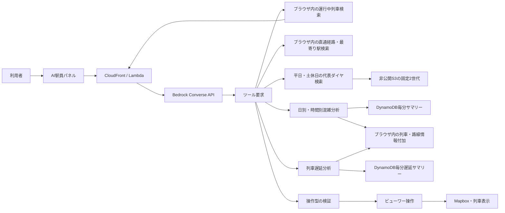

# AI駅員のクライアント境界

## 状態

第4段階。ユーザー向けチャットパネル、AIが要求できる画面操作の型・実行前検証、
列車検索・到着時刻検索・直通経路検索・表示時刻変更・カメラ移動、天気・景色・可視化レイヤーの変更、
平日・土休日の代表ダイヤ検索、保存済み混雑履歴の日別・時間別・路線別・列車別分析と、
列車遅延の現在・日別・時間別分析を
実装し、Amazon Bedrock Nova Liteへ接続済み。
会話保存、音声案内、外部書き込みは接続していない。

## 目的

AI駅員は、質問に文章で答えるだけでなく、列車検索の結果を使って表示時刻、
カメラ、天気、景色、可視化レイヤーを操作する案内役を目指す。

モデルがブラウザ内部を直接操作する構成にはせず、モデルが返す要求を狭い操作型へ
変換し、検証を通過した操作だけをビューワーが実行する。

開発サーバーでAI APIへ接続できない場合だけ、ローカル自然文解析へフォールバックする。
ローカル解析でも、列車・到着検索、表示時刻、天気、可視化レイヤーを操作できる。
本番ビルドではAPIエラーを成功として隠さず、パネルに再試行案内を表示する。

Bedrock接続とローカル解析は、直通経路の検索基準時刻を決める同じドメイン規則を使う。
ローカル解析はDOMを直接参照せず、現在時刻の取得・変更、列車フォーカス、画面操作を
依存関数として受け取る。再生状態は独立したコントローラーが管理し、AIや手動操作による
時刻変更では再生・停止状態を変えない。

クライアント実装では、AI APIのデータ型、HTTP通信、実行時レスポンス検証を別モジュールに
分ける。列車選択・追跡と詳細パネル描画も起動処理から分離し、`main.ts`は依存の接続を
担当する。CSSは`viewer.css`を唯一の入口とし、地図・ローディング・テーマUIの順序を固定する。
LambdaではHTTP入力契約を`request_contract.py`、DynamoDBの日付・ページング・数値変換を
`dynamodb_analysis.py`へ分離し、`handler.py`はBedrockツール定義、分析の組み立て、入口を担当する。

## 接続済みの基本機能

| 機能 | 現在の動作 |
| --- | --- |
| 列車検索 | 入力文に含まれる駅名、種別、列車名、列車番号から、その時刻に運行中の列車を検索する |
| 到着時刻検索 | 指定時刻の前後30分に指定駅へ到着する列車を、種別と組み合わせて検索する |
| 直通経路検索 | 出発駅から行き先まで同じ列車で行ける候補を最大3件返す。出発駅の省略時は現在地から直通可能な最寄り駅を選ぶ |
| 代表ダイヤ検索 | 非公開S3の最新の平日・土休日代表から、列車・到着・出発を検索する |
| 表示時刻変更 | `18時30分`、`25:05`などを読み取り、再生状態を維持したまま該当時刻へ移動する |
| カメラ移動 | 検索結果の先頭列車を選択し、詳細を開いて現在位置へ移動・追跡する |
| 混雑履歴 | 4時切替の業務日付を指定し、日次ピーク、1時間ごとの推移、行き先側路線順位、種別・列車名・行き先付き列車順位を分析する |
| 列車遅延 | 4時切替の業務日付を指定し、最新状況、日次ピーク、1時間ごとの遅延傾向、種別・列車名・行き先付き列車順位を分析する |
| 天気 | 晴れ、曇り、雨、雪を変更する |
| 可視化レイヤー | 混雑の棒グラフと目的地アーチを個別に表示・非表示にする |

駅名検索では、現在時刻より後に停車する駅を対象とする。時刻と検索条件が同じ依頼に
含まれる場合は、先に時刻を変更して列車位置を再計算してから検索する。
直通経路検索の出発時刻はブラウザ側で決定し、利用者が時刻を指定した場合はその時刻、
指定しなかった場合は現在の表示時刻を使う。モデルが異なる時刻を指定しても採用しない。
直通経路検索では表示時刻を候補の発車時刻へ移動せず、現在の時刻から再生を続ける。
候補列車が運行中なら現在位置へフォーカスし、運行開始前なら経路だけを案内する。
直通経路の発着時刻はモデルに分数から換算させず、ブラウザが24時以降を翌日の通常時刻へ
変換して最終案内文を生成する。これにより、`1475`分を`14:45`と誤変換するような暗算誤りを防ぐ。
出発駅と行き先を入力文から特定できる場合もブラウザの解析結果を優先し、モデルによる駅名の
省略や末尾の「駅」の有無で、現在地検索へ切り替わったり表示が重複したりしないようにする。
AI案内APIの通信失敗、スロットリング、サーバーエラーは、読み取り専用の呼び出しを1回だけ
再試行し、一時的な失敗を減らす。
混雑・遅延分析の「今日」は4:00〜翌3:59の業務日付とする。ブラウザは現在時刻をJSTの
業務日付へ変換してモデルへ渡し、Lambdaは指定日の4:00から翌日4:00未満までを2つの
暦日パーティションから取得する。既存の暦日単位データも移行せず同じ境界で集計できる。

## 許可する画面操作

| 操作 | 用途 |
| --- | --- |
| `set_display_time` | 表示時刻を変更する |
| `focus_train` | 指定した列車を選択・追跡する |
| `set_weather` | 晴れ、曇り、雨、雪を変更する |
| `set_layer_visibility` | 混雑棒、行先アーチを表示・非表示にする |

これらはビューワー内で完結し、取り消し可能な操作に限定する。未知の操作、不足した引数、
負の表示時刻、未知の列車レイヤーなどは実行前に拒否する。

## 現在のパネル

- 地図上から開閉できる。
- 直通経路検索を含む案内の入口をこのパネルへ統合し、独立した経路検索パネルは持たない。
- 利用者のメッセージと案内役のメッセージを分けて表示する。
- 代表的な依頼を入力欄へ設定できる質問例を持つ。
- 基本操作として、時刻、駅名、列車種別、列車名、列車番号を含む依頼を処理する。
- 検索結果が複数ある場合は件数を示し、最上位の列車へ移動する。
- 条件に合う運行中列車がない場合は、対象時刻とともにその旨を示す。
- 利用者入力はDOMへHTMLとして挿入せず、テキストとして表示する。
- 応答待ちの間は、推論本文ではなく「考え中」の進行状態を表示する。
- モデル応答に含まれる`<thinking>`ブロックは表示せず、`<response>`があれば
  その内側だけを利用者向けメッセージとして表示する。
- 利用者が求めていない現在の表示時刻や日付は、最終回答で機械的に復唱しない。

## Bedrock接続の境界

- APIキーはブラウザやS3の静的ファイルへ置かない。
- AI呼び出しはCloudFront OACからだけ呼べるIAM認証付きLambda Function URLを経由する。
- CloudFrontのBasic認証をAI APIにも適用し、応答をキャッシュしない。
- LambdaはAmazon Nova LiteのConverse APIを呼び、履歴検索要求は検証後にDynamoDB、
  代表ダイヤ検索は非公開S3を読み取る。地図操作と当日列車検索はブラウザ側で実行する。
  直通経路検索と現在地からの最寄り駅選択もブラウザ側で実行する。
- 248MBの列車入力全体をモデルへ送信せず、検索ツールが必要な候補だけを返す。
- 現在地の緯度・経度は駅選択にだけ使用し、Lambda、Bedrock、ログへ送らない。位置情報を
  利用できない場合は出発駅入力へフォールバックする。
- モデルが指定できる検索結果は最大5件とする。
- 代表ダイヤは平日・土休日の最新1件ずつだけを保持し、Lambdaで駅・種別・列車名・列車番号と
  時刻条件を決定的に検索する。全データをブラウザやモデルへ返さない。
- 混雑分析は1日分の生S3アーカイブではなく、同じ合算規則で生成したDynamoDBサマリーを使う。
- Lambdaで日次ピーク、JSTの24時間バケット、列車番号別統計を計算し、ブラウザで既存時刻表と
  結合して種別、列車名、行き先、行き先側路線を付加する。
- モデルへは観測期間・件数、24時間の集計、上位5路線、上位5列車、未判定件数だけを渡し、
  全列車統計と毎分データは渡さない。未観測時間は混雑ゼロとして扱わない。
- 遅延も毎分データをLambdaで日次・時間別・列車別に集計し、ブラウザで時刻表情報を
  付加した最新・ピーク・24時間集計・上位5列車だけをモデルへ渡す。
- `focus_train` は同じ依頼内の `search_trains` または `search_direct_routes` が返した
  `serviceUid` だけを受け付ける。
- モデルの画面操作をそのまま実行せず、`parseViewerAgentActions` を通す。
- API本文は32KiB、会話は16メッセージ、ブラウザ側ツール往復は6回を上限とする。
- 外部書き込みや破壊的操作を追加する場合は、現在の画面操作とは別の承認境界を設ける。
