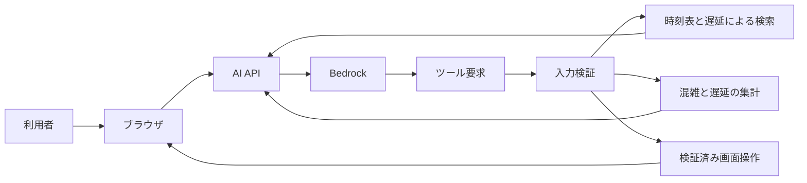

# AI駅員の境界

## 目的

AI駅員は自然文を検索条件と安全な画面操作へ変換する
モデルへ列車データ全体やブラウザ操作権限を渡さない

開発サーバーでAI APIへ接続できない場合だけローカル解析へフォールバックする
本番ではAPI失敗を成功として扱わず再試行案内を表示する

## 機能

| 機能 | 動作 |
| --- | --- |
| 列車検索 | 駅 種別 列車名 列車番号から運行中列車を検索 |
| 到着検索 | 指定時刻の前後30分に指定駅へ到着する列車を検索 |
| 直通経路検索 | 営業日ごとの接続インデックスから最大3件を検索 |
| 代表ダイヤ検索 | 平日と土休日の代表ダイヤから最大5件を検索 |
| 混雑分析 | 業務日付の日次ピーク 時間別傾向 路線別 列車別を集計 |
| 遅延分析 | 最新状況 日次ピーク 時間別傾向 列車別を集計 |
| 画面操作 | 時刻 列車フォーカス 天候 可視化レイヤーを変更 |

## 直通経路検索

- 出発駅 到着駅 業務日付 希望時刻をバックエンドへ送る
- 非公開S3の`timetable-connection-index-v1`をLambdaで検索
- 同一列車の継続 最低乗換時間 乗換上限 最新遅延を決定的に評価
- 現在のAIツールは乗換上限0として直通だけを返す
- 出発駅省略時の最寄り駅選択は端末内で行う
- 表示時計を候補列車の発車時刻へ移動しない
- 深夜帯の発着時刻はブラウザで通常時刻へ整形

検索ごとに`journey_search_trace`を構造化ログへ出す
走査数 時刻前の除外 到達不能 乗換時間不足 乗換上限 採用候補を確認できる

## 許可する画面操作

| 操作 | 用途 |
| --- | --- |
| `set_display_time` | 表示時刻を変更 |
| `focus_train` | 列車を選択して追跡 |
| `set_weather` | 天候を変更 |
| `set_layer_visibility` | 混雑棒と行き先アーチを切り替え |

未知の操作 不足した引数 無効な時刻 未知のレイヤーを実行前に拒否する
`focus_train`は同じ依頼内の検索結果に含まれる`serviceUid`だけを受け付ける

## データ境界

- 現在地の緯度経度をLambda Bedrock ログへ送信しない
- 全量の列車入力 生S3アーカイブ 毎分履歴をモデルへ送信しない
- Lambdaが決定的に検索または集計した上位結果だけをモデルへ渡す
- 未観測時間をゼロとして扱わない
- API本文 会話数 ツール往復数に上限を設ける
- 利用者入力をHTMLとして描画しない
- 会話を保存しない
- 外部書き込みや破壊的操作を追加しない

## 実装の分離

- クライアント契約 通信 レスポンス検証を別モジュールに分ける
- 列車選択と追跡を起動処理から分離する
- Lambdaの入力契約 DynamoDB集計 経路探索を入口ハンドラーから分離する
- 再生状態は時刻変更から独立して管理する
