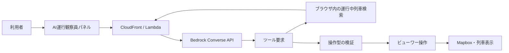

# AI運行観察員のクライアント境界

## 状態

第3段階。ユーザー向けチャットパネル、AIが要求できる画面操作の型・実行前検証、
列車検索・表示時刻変更・カメラ移動を実装し、Amazon Bedrock Nova Liteへ接続済み。
会話保存、音声案内、外部書き込みは接続していない。

## 目的

AI運行観察員は、質問に文章で答えるだけでなく、列車検索の結果を使って表示時刻、
カメラ、天気、景色、可視化レイヤーを操作する案内役を目指す。

モデルがブラウザ内部を直接操作する構成にはせず、モデルが返す要求を狭い操作型へ
変換し、検証を通過した操作だけをビューワーが実行する。

開発サーバーでAI APIへ接続できない場合だけ、従来のローカル自然文解析へフォールバック
する。本番ビルドではAPIエラーを成功として隠さず、パネルに再試行案内を表示する。

## 接続済みの基本機能

| 機能 | 現在の動作 |
| --- | --- |
| 列車検索 | 入力文に含まれる駅名、種別、列車名、列車番号から、その時刻に運行中の列車を検索する |
| 表示時刻変更 | `18時30分`、`25:05`などを読み取り、再生を停止して該当時刻へ移動する |
| カメラ移動 | 検索結果の先頭列車を選択し、詳細を開いて現在位置へ移動・追跡する |

駅名検索では、現在時刻より後に停車する駅を対象とする。時刻と検索条件が同じ依頼に
含まれる場合は、先に時刻を変更して列車位置を再計算してから検索する。

## 許可する画面操作

| 操作 | 用途 |
| --- | --- |
| `set_display_time` | 表示時刻を変更する |
| `focus_train` | 指定した列車を選択・追跡する |
| `set_weather` | 晴れ、雨、雪を変更する |
| `set_scene_mode` | 通常、模型表示を変更する |
| `set_layer_visibility` | 混雑棒、行先アーチを表示・非表示にする |

これらはビューワー内で完結し、取り消し可能な操作に限定する。未知の操作、不足した引数、
負の表示時刻、未知の列車レイヤーなどは実行前に拒否する。

## 現在のパネル

- 地図上から開閉できる。
- 利用者のメッセージと案内役のメッセージを分けて表示する。
- 代表的な依頼を入力欄へ設定できる質問例を持つ。
- 基本操作として、時刻、駅名、列車種別、列車名、列車番号を含む依頼を処理する。
- 検索結果が複数ある場合は件数を示し、最上位の列車へ移動する。
- 条件に合う運行中列車がない場合は、対象時刻とともにその旨を示す。
- 利用者入力はDOMへHTMLとして挿入せず、テキストとして表示する。

## Bedrock接続の境界

- APIキーはブラウザやS3の静的ファイルへ置かない。
- AI呼び出しはCloudFront OACからだけ呼べるIAM認証付きLambda Function URLを経由する。
- CloudFrontのBasic認証をAI APIにも適用し、応答をキャッシュしない。
- LambdaはAmazon Nova LiteのConverse APIだけを呼び、ツール自体は実行しない。
- 248MBの列車入力全体をモデルへ送信せず、検索ツールが必要な候補だけを返す。
- モデルが指定できる検索結果は最大5件とする。
- `focus_train` は同じ依頼内の `search_trains` が返した `serviceUid` だけを受け付ける。
- モデルの時刻・列車操作をそのまま実行せず、`parseViewerAgentActions` を通す。
- API本文は32KiB、会話は16メッセージ、ブラウザ側ツール往復は6回を上限とする。
- 外部書き込みや破壊的操作を追加する場合は、現在の画面操作とは別の承認境界を設ける。
