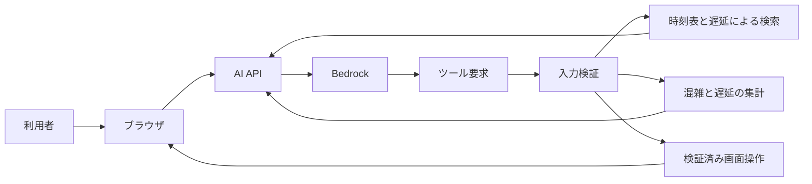

# コンシェルジュの境界

## 目的

コンシェルジュは自然文を検索条件と安全な画面操作へ変換する
モデルへ列車データ全体やブラウザ操作権限を渡さない



開発サーバーでAI APIへ接続できない場合だけローカル解析へフォールバックする
本番ではAPI失敗を成功として扱わず再試行案内を表示する

## 機能

| 機能 | 動作 |
| --- | --- |
| 列車検索 | 駅 種別 列車名 列車番号から運行中列車を検索 |
| 到着検索 | 指定時刻の前後30分に指定駅へ到着する列車を検索 |
| 経路検索 | 営業日ごとの接続インデックスから直通または乗換3回までの最大3件を検索 |
| 代表ダイヤ検索 | 平日と土休日の代表ダイヤから最大5件を検索 |
| 混雑分析 | 業務日付の日次ピーク 時間別傾向 路線別 列車別を集計 |
| 遅延分析 | 最新状況 日次ピーク 時間別傾向 列車別を集計 |
| 旅行相談の追加質問 | 次の質問 選択肢 TripContext を構造化して返し ブラウザは共通UIで回答を受け取る |
| 画面操作 | 時刻 列車フォーカス 天候 可視化レイヤーを変更 |

## 経路検索

- 出発駅 到着駅 業務日付 希望時刻をバックエンドへ送る
- 利用者の日付指定は暦日として解釈し 4時未満は前の業務日付と24時超時刻へ変換する
- 平日と土休日をクライアントで判定せず 日付別インデックス内の`timetable_kind`を正とする
- 非公開S3の`timetable-connection-index-v1`を多目的CSAで検索
- 最大3回の乗換を探索し 到着時刻 出発時刻 乗換回数のPareto候補を保持する
- 乗換時間は既定5分と駅固有値を正本にして 急ぐ 普通 ゆっくりで補正する
- 経路優先はバランス 早く着く 遅く出る 乗換少なめから選ぶ
- 遅く出る候補は最速到着から45分以内として 無制限に遅い列車を選ばない
- 展開後の接続インデックスはLambda内で直近1件だけ保持し 日付切替によるメモリ増加を防ぐ
- 設定はブラウザへ保存し 自然言語による指定はその検索だけに適用する
- 出発駅省略時の最寄り駅選択は端末内で行う
- 表示時計を候補列車の発車時刻へ移動しない
- 深夜帯の発着時刻はブラウザで通常時刻へ整形
- 現在の業務日付かつ現在時刻付近ではS3の最新`delays.json`から遅延 行き先変更 運休を評価する
- 乗車予定列車に実測値があれば発着時刻と乗換判定へ直接反映する
- 未観測列車は検索時刻から2時間以内に同じ向きの同一駅間へ入るものに限り 前後90分以内の実測列車から最大3件の中央値を遅延見込みとして反映する
- 逆方向 別の駅間 2時間より先の列車へ遅延を伝播させず 実測遅延と遅延見込みを画面で区別する
- 未来日 過去日 古いスナップショット 取得失敗を含むスナップショットでは計画ダイヤだけを使う
- 候補は構造化データとして返し タブと路線色付き区間として描画する
- 途中停車駅は直前の経路に対する追質問として回答する
- 「京都から岡山は新幹線が良い」のような指定は直前の経路の連続区間として扱い 後続区間と終着駅を維持する
- 区間の別列車や別経路は候補だけを先に返し 利用者が番号か列車名で確定した後に経路を差し替える
- 「新幹線を使わない」「特急を避けて」などは直前の出発駅 到着駅 日付 時刻 乗換設定を保持して再検索する
- 種別 列車名 列車番号 文脈で指定した特定列車を除外でき 連続した依頼では除外条件を引き継ぐ
- 除外対象は候補取得後ではなく接続走査と直通インデックス探索の入口で除外する
- 「やくもに乗りたい」「特急で行きたい」は経路の少なくとも1区間で満たす必須条件として検索する
- 「鈍行で行きたい」「各駅停車だけ」は全区間を普通列車へ限定し 特急 新幹線 快速を混在させない
- 出発駅と到着駅より先に伝えられた希望はブラウザ内だけで一時保持し 次に成功した経路検索へ適用する
- 必須条件は最大4件に制限し 条件充足状態をビットマスクとしてCSAラベルへ含める
- 運賃 座席 空席 景色 観光は対応する正本データがないため検索順位へ使わず 未対応であることを明示する
- 宿泊候補は日程と行き先を明示した場合だけ外部提供者へ問い合わせる。空室と日付別の料金は推測しない

### 対話から検索条件への変換

旅行相談では `ask_follow_up` を使い 出発日 宿泊数 人数などの不足条件を確認する。画面側は
質問の種類を判断せず 構造化された質問と候補を描画する。回答時は保持済みの `TripContext` と
直前の質問をモデルへ渡す。普段の好みである `UserProfile` と 今回限りの `TripContext` は混在させない。

| 利用者の表現 | 検索契約 | 適用範囲 |
| --- | --- | --- |
| やくもに乗りたい はるか15号に乗りたい | 必須列車名または列車番号 | 経路の1区間以上 |
| 特急で行きたい 新幹線を使いたい | 必須列車種別 | 経路の1区間以上 |
| 鈍行で行きたい 各駅停車だけ | 許可列車種別を普通へ限定 | 経路の全区間 |
| 特急を使いたくない 1005Mを避けて 在来線で行きたい | 除外する種別 列車名 列車番号 列車ID | 経路の全区間 |
| 乗換なし 乗換2回まで | 最大乗換回数 | 経路全体 |
| ゆっくり乗換 早く着きたい 遅く出たい | 乗換ペースまたは順位 | 候補探索と並び順 |

列車名は号数を省略した系列名と号数付きの特定列車を区別する
例えば「やくも」はやくも各号のいずれかを許し「やくも5号」はその列車だけを許す
必須条件を満たさない最速経路が条件付き経路を支配しないよう 条件充足状態ごとにParetoラベルを保持する

検索ごとに`journey_search_trace`を構造化ログへ出す
接続走査数 支配判定で除外したラベル数 乗換時間不足 打ち切り条件
採用経路 乗換駅 待ち時間 適用した嗜好を確認できる
除外 必須 許可した種別 列車名 列車番号 列車IDと条件で除外した列車 接続の件数も確認できる
リアルタイム情報の適用可否と適用しなかった理由も確認できる
実測遅延と遅延見込みを適用した列車数も確認できる

### 経路検索シナリオ

`tests/fixtures/journey-search-scenarios.json`へ小さな列車と期待経路を記述する
実在の時刻表やS3へ接続せず 直通 乗換時間 嗜好 遅延 深夜時刻を決定的に再現できる

```bash
python3 tools/run_journey_search_scenarios.py
python3 tools/run_journey_search_scenarios.py latest-departure
python3 tools/run_journey_search_scenarios.py --list
```

通常のPythonテストでも全シナリオを実行するため CIへの追加設定は不要

## 許可する画面操作

| 操作 | 用途 |
| --- | --- |
| `set_display_time` | 表示時刻を変更 |
| `focus_train` | 列車を選択して追跡 |
| `set_weather` | 天候を変更 |
| `set_layer_visibility` | 混雑棒と行き先アーチを切り替え |

未知の操作 不足した引数 無効な時刻 未知のレイヤーを実行前に拒否する
`focus_train`は同じ依頼内の検索結果に含まれる`serviceUid`だけを受け付ける

## データ境界

- 現在地の緯度経度をLambda Bedrock ログへ送信しない
- 全量の列車入力 生S3アーカイブ 毎分履歴をモデルへ送信しない
- Lambdaが決定的に検索または集計した上位結果だけをモデルへ渡す
- 未観測時間をゼロとして扱わない
- API本文 会話数 ツール往復数に上限を設ける
- 利用者入力をHTMLとして描画しない
- 会話は保存しない。ただし利用者が応答の評価を送信した場合だけ、評価時点までの会話本文と関連リクエストIDを非公開のフィードバック保存先へ90日間保存する
- AI API応答ヘッダーのx-transitforge-request-idと構造化ログのrequestIdを対応付ける
- 外部書き込みや破壊的操作を追加しない

## 実装の分離

- クライアント契約 通信 レスポンス検証を別モジュールに分ける
- AI通信は本文と`x-transitforge-request-id`由来のメタデータを組で返す。最新IDをモジュール共有状態へ保存せず 応答ごとに会話履歴へ渡す
- 列車選択と追跡を起動処理から分離する
- Lambdaの入力契約 DynamoDB集計 経路探索を入口ハンドラーから分離する
- 再生状態は時刻変更から独立して管理する
