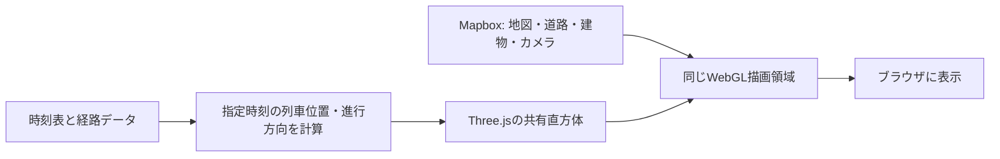
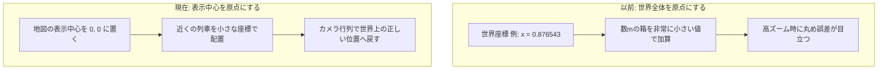
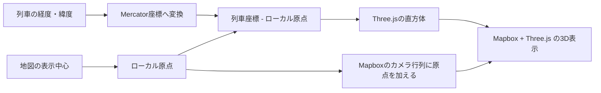

# MapboxとThree.jsによる列車描画

列車の3D直方体をMapboxへ重ねる現在の実装を説明する

## 何をしているか

- **Mapbox** が地図、道路、建物、カメラ操作を描画する。
- **Three.js** が列車を直方体として描画し、混雑棒と行先アーチを同じ座標系へ重ねる。
- Three.jsは別の画面を作らず、Mapboxの画面と同じWebGL描画領域を使う。
- 列車はMapboxの **3D Custom Layer** として追加される。そのため、地図を傾けたり
  ズームしたりしても、地図と同じカメラで見える。

「共有直方体」とは、列車ごとに3Dモデルを作るのではなく、1個の箱の形を共有し、
列車ごとに位置・向き・色だけを変える方法である。多数の列車を扱う際の負荷を抑えられる。

行先アーチは、列車の現在位置と、経路上の最終停車位置を24本の短い線分で結ぶ。
ラインカラーを使用し、距離の16%を基本とする高さを持たせるが、広域表示で過度に
高くならないよう30kmを上限とする。初期状態では非表示で、UIから独立して切り替えられる。

## 以前の問題

地図用のMercator座標は、世界全体をおおよそ `0` から `1` の数で表す。
一方、列車の箱は数m程度であり、この座標系では非常に小さな数になる。

世界の大きな座標の近くで非常に小さな箱を計算すると、GPUが扱える数値の細かさが足りず、
特に高ズーム時に輪郭や底面が揺れたり、形が変わったように見えたりすることがある。

## 現在の描画手順

1. 時刻表と経路から、各列車の経度・緯度と進行方向を計算する。
2. 地図の現在の表示中心を、Three.js側のローカル座標の原点にする。
3. 列車位置からその原点を引き、原点の近くに直方体を配置する。
4. Mapboxが渡すカメラ行列へ「原点を世界座標へ戻す変換」と座標軸の変換を加える。
5. Mapboxと共有する深度情報を使い、建物・道路・列車を同じ3D空間として表示する。

## 向きと底面

- 直方体の長手方向は、経路座標の前後から求めた進行方向へ回転する。
- 列車ごとの直方体には負の拡大縮小を使わない。箱の形は常に同じである。
- 箱の高さの半分だけ上に置くため、平坦な地図面では底面が地面の高さに来る。
- 経路座標の細かな折れや駅代表点への短い折り返しで向きが反転しないよう
  前後300mから進行方向を求め 表示する向きは前回値から補間する
- フォーカスリングは車体上ではなく、地面から15cm相当だけ浮かせた位置で列車へ追従させる。
- 半透明マテリアルと深度判定を使い、リングの上に車体が自然に重なるよう描画する。

斜め上からの3D表示では、正しい直方体でも遠い辺が短く見えるため、面が台形に見える。
これは透視投影による自然な見え方であり、箱が変形していることとは別である。

## 分割列車と併結列車

時刻表上で複数の`service_uid`へ分割された同一列車と 実際に併結して走る列車は
どちらも共通の連結配置を使う

- 同一列車の続きは列車番号が同じで 位置が20m以内かつ進行方向が近い場合だけ連結する
- 関空快速と紀州路快速は列車番号の対応 位置 進行方向から併結を判定する
- 米原で増解結する新快速は京阪神側の`34xxM`と北陸本線側の`32xxM`を
  同じ下2桁 米原接続10分以内という条件で関連付ける
- 米原接続は京阪神側の区間だけを併結表示し 北陸本線側だけの区間では一つに戻す
- 同一列車の続きと実際の併結は別の種別として保持する
- 連結した二つの表示は半分ずつとし 全体を単一列車と同じ長さにする
- 離れた場所にある同じ列車番号は連結しない

編成の増解結を伴わない単純な時刻表分割は同時表示せず
その時点で運行中の区間だけを表示する

## この方式で扱わないこと

- 地形の起伏に列車の底面を追従させること。現在は平坦な地図面を基準とする。
- 実物の車両モデル、台車、編成長、車種ごとの外観。
- 線路の高さ・勾配・カントに合わせた車体姿勢。

これらが必要になった場合は、入力データの表現と性能を確認した上で、別途判断する。

## 実装場所と確認方法

- 実装: `frontend/src/presentation/train-viewer/rendering/mapbox-three-train-layer.ts`
- 行先アーチの純粋な高さ・頂点計算: `frontend/src/domain/destination-arc-geometry.ts`
- WebGLに依存しない行先アーチ計算は単体テストし、描画クラスはMapbox・Three.jsへの
  データ反映に専念する。
- 動作確認: `npm run dev` で起動し、列車が表示される場所をズーム・回転・再生して確認する。
- 自動確認: `npm test` と `npm run build`
